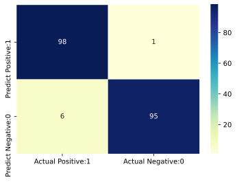

### import modules


```python
import numpy as np
import pandas as pd
import matplotlib.pyplot as plt
import seaborn as sns
from sklearn.model_selection import train_test_split
from sklearn import datasets
```

### import datasets


```python
X, y = datasets.make_classification(n_samples=1000, n_features=10, n_classes=2, random_state=123)
X_train, X_test, y_train, y_test = train_test_split(X, y, test_size=0.2, random_state=123)
```

### Model Training


```python
from sklearn.naive_bayes import GaussianNB

nb = GaussianNB()
nb.fit(X_train, y_train)
```


    GaussianNB()


### Predict the results


```python
y_pred = nb.predict(X_test)
y_pred.shape
```


    (200,)


```python
from sklearn.metrics import accuracy_score

print('Model accuracy score: {0:0.4f}'. format(accuracy_score(y_test, y_pred)))
```

    Model accuracy score: 0.9650


### Confusion Matrix


```python
from sklearn.metrics import confusion_matrix

confusion_matrix = confusion_matrix(y_test, y_pred)
print('Confusion matrix\n\n', confusion_matrix)
```

    Confusion matrix
    
     [[98  1]
     [ 6 95]]


### Visualize confusion matrix


```python
cm_matrix = pd.DataFrame(data=confusion_matrix, columns=['Actual Positive:1', 'Actual Negative:0'], 
                                 index=['Predict Positive:1', 'Predict Negative:0'])

sns.heatmap(cm_matrix, annot=True, fmt='d', cmap='YlGnBu')
```


    <AxesSubplot:>


    

    

