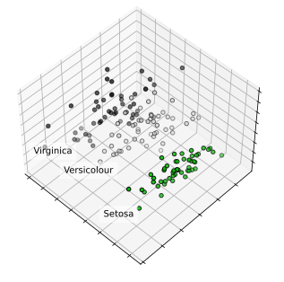

```python
import numpy as np
```

1.calculate mean values of each feature/column
2.subtracting the mean column value for each column
3.calculate covariance matrix of the centered matrix C
4.calculate list of engenvalues and eigenvectors
5.select k eigenvectors/principal components


```python
A = np.array([[1,2],[3,4],[5,6]])
print(A)
M = np.mean(A.T, axis=1)
print(M)
C=A-M
print(C)
V=np.cov(C.T)
print(V)
# eigendecomposition of covariance matrix
values, vectors = np.linalg.eig(V)
print(vectors)
print(values)
# project data
P = vectors.T.dot(C.T)
print(P.T)
print(P.T.shape)
```

    [[1 2]
     [3 4]
     [5 6]]
    [3. 4.]
    [[-2. -2.]
     [ 0.  0.]
     [ 2.  2.]]
    [[4. 4.]
     [4. 4.]]
    [[ 0.70710678 -0.70710678]
     [ 0.70710678  0.70710678]]
    [8. 0.]
    [[-2.82842712  0.        ]
     [ 0.          0.        ]
     [ 2.82842712  0.        ]]
    (3, 2)


```python
np.var([-2,-2])
C.T
```


    array([[-2.,  0.,  2.],
           [-2.,  0.,  2.]])


```python
from sklearn.decomposition import PCA
A=np.array([[1,2],[3,4],[5,6]])
print(A)
pca = PCA(2) #chosen number of dimensions
pca.fit(A)
print(pca.components_)
print(pca.explained_variance_)
B = pca.transform(A)
print(B)                   
```

    [[1 2]
     [3 4]
     [5 6]]
    [[ 0.70710678  0.70710678]
     [-0.70710678  0.70710678]]
    [8. 0.]
    [[-2.82842712e+00 -2.22044605e-16]
     [ 0.00000000e+00  0.00000000e+00]
     [ 2.82842712e+00  2.22044605e-16]]


```python
print(__doc__)
```

    Automatically created module for IPython interactive environment


```python
import matplotlib.pyplot as plt
from mpl_toolkits.mplot3d import Axes3D

from sklearn import decomposition
from sklearn import datasets

np.random.seed(5)

centers = [[1,1],[-1,1],[1,-1]]
iris = datasets.load_iris()
X = iris.data
y = iris.target

print(X.shape,y.shape)
print(y)
```

    (150, 4) (150,)
    [0 0 0 0 0 0 0 0 0 0 0 0 0 0 0 0 0 0 0 0 0 0 0 0 0 0 0 0 0 0 0 0 0 0 0 0 0
     0 0 0 0 0 0 0 0 0 0 0 0 0 1 1 1 1 1 1 1 1 1 1 1 1 1 1 1 1 1 1 1 1 1 1 1 1
     1 1 1 1 1 1 1 1 1 1 1 1 1 1 1 1 1 1 1 1 1 1 1 1 1 1 2 2 2 2 2 2 2 2 2 2 2
     2 2 2 2 2 2 2 2 2 2 2 2 2 2 2 2 2 2 2 2 2 2 2 2 2 2 2 2 2 2 2 2 2 2 2 2 2
     2 2]


```python
pca = decomposition.PCA(n_components=3)
pca.fit(X)
X = pca.transform(X)
print(X)
# print(X[y==1,0])
# print(X[:,0])
```

    [[-2.68412563  0.31939725 -0.02791483]
     [-2.71414169 -0.17700123 -0.21046427]
     [-2.88899057 -0.14494943  0.01790026]
     [-2.74534286 -0.31829898  0.03155937]
     [-2.72871654  0.32675451  0.09007924]
     [-2.28085963  0.74133045  0.16867766]
     [-2.82053775 -0.08946138  0.25789216]
     [-2.62614497  0.16338496 -0.02187932]
     [-2.88638273 -0.57831175  0.02075957]
     [-2.6727558  -0.11377425 -0.19763272]
     [-2.50694709  0.6450689  -0.07531801]
     [-2.61275523  0.01472994  0.10215026]
     [-2.78610927 -0.235112   -0.20684443]
     [-3.22380374 -0.51139459  0.06129967]
     [-2.64475039  1.17876464 -0.15162752]
     [-2.38603903  1.33806233  0.2777769 ]
     [-2.62352788  0.81067951  0.13818323]
     [-2.64829671  0.31184914  0.02666832]
     [-2.19982032  0.87283904 -0.12030552]
     [-2.5879864   0.51356031  0.21366517]
     [-2.31025622  0.39134594 -0.23944404]
     [-2.54370523  0.43299606  0.20845723]
     [-3.21593942  0.13346807  0.29239675]
     [-2.30273318  0.09870885  0.03912326]
     [-2.35575405 -0.03728186  0.12502108]
     [-2.50666891 -0.14601688 -0.25342004]
     [-2.46882007  0.13095149  0.09491058]
     [-2.56231991  0.36771886 -0.07849421]
     [-2.63953472  0.31203998 -0.1459089 ]
     [-2.63198939 -0.19696122  0.04077108]
     [-2.58739848 -0.20431849 -0.07722299]
     [-2.4099325   0.41092426 -0.14552497]
     [-2.64886233  0.81336382  0.22566915]
     [-2.59873675  1.09314576  0.15781081]
     [-2.63692688 -0.12132235 -0.14304958]
     [-2.86624165  0.06936447 -0.16433231]
     [-2.62523805  0.59937002 -0.26835038]
     [-2.80068412  0.26864374  0.09369908]
     [-2.98050204 -0.48795834  0.07292705]
     [-2.59000631  0.22904384 -0.0800823 ]
     [-2.77010243  0.26352753  0.07724769]
     [-2.84936871 -0.94096057 -0.34923038]
     [-2.99740655 -0.34192606  0.19250921]
     [-2.40561449  0.18887143  0.26386795]
     [-2.20948924  0.43666314  0.29874275]
     [-2.71445143 -0.2502082  -0.09767814]
     [-2.53814826  0.50377114  0.16670564]
     [-2.83946217 -0.22794557  0.08372685]
     [-2.54308575  0.57941002 -0.01711502]
     [-2.70335978  0.10770608 -0.08929401]
     [ 1.28482569  0.68516047 -0.40656803]
     [ 0.93248853  0.31833364 -0.01801419]
     [ 1.46430232  0.50426282 -0.33832576]
     [ 0.18331772 -0.82795901 -0.17959139]
     [ 1.08810326  0.07459068 -0.3077579 ]
     [ 0.64166908 -0.41824687  0.04107609]
     [ 1.09506066  0.28346827  0.16981024]
     [-0.74912267 -1.00489096  0.01230292]
     [ 1.04413183  0.2283619  -0.41533608]
     [-0.0087454  -0.72308191  0.28114143]
     [-0.50784088 -1.26597119 -0.26981718]
     [ 0.51169856 -0.10398124  0.13054775]
     [ 0.26497651 -0.55003646 -0.69414683]
     [ 0.98493451 -0.12481785 -0.06211441]
     [-0.17392537 -0.25485421  0.09045769]
     [ 0.92786078  0.46717949 -0.31462098]
     [ 0.66028376 -0.35296967  0.32802753]
     [ 0.23610499 -0.33361077 -0.27116184]
     [ 0.94473373 -0.54314555 -0.49951905]
     [ 0.04522698 -0.58383438 -0.2350021 ]
     [ 1.11628318 -0.08461685  0.45962099]
     [ 0.35788842 -0.06892503 -0.22985389]
     [ 1.29818388 -0.32778731 -0.34785435]
     [ 0.92172892 -0.18273779 -0.23107178]
     [ 0.71485333  0.14905594 -0.32180094]
     [ 0.90017437  0.32850447 -0.31620907]
     [ 1.33202444  0.24444088 -0.52170278]
     [ 1.55780216  0.26749545 -0.16492098]
     [ 0.81329065 -0.1633503   0.0354245 ]
     [-0.30558378 -0.36826219 -0.31849158]
     [-0.06812649 -0.70517213 -0.24421381]
     [-0.18962247 -0.68028676 -0.30642056]
     [ 0.13642871 -0.31403244 -0.17724277]
     [ 1.38002644 -0.42095429  0.01616713]
     [ 0.58800644 -0.48428742  0.4444335 ]
     [ 0.80685831  0.19418231  0.38896306]
     [ 1.22069088  0.40761959 -0.23716701]
     [ 0.81509524 -0.37203706 -0.61472084]
     [ 0.24595768 -0.2685244   0.18836681]
     [ 0.16641322 -0.68192672 -0.06000923]
     [ 0.46480029 -0.67071154 -0.02430686]
     [ 0.8908152  -0.03446444 -0.00994693]
     [ 0.23054802 -0.40438585 -0.22941024]
     [-0.70453176 -1.01224823 -0.10569115]
     [ 0.35698149 -0.50491009  0.01661717]
     [ 0.33193448 -0.21265468  0.08320429]
     [ 0.37621565 -0.29321893  0.07799635]
     [ 0.64257601  0.01773819 -0.20539497]
     [-0.90646986 -0.75609337 -0.01259965]
     [ 0.29900084 -0.34889781  0.01058166]
     [ 2.53119273 -0.00984911  0.76016543]
     [ 1.41523588 -0.57491635  0.29632253]
     [ 2.61667602  0.34390315 -0.11078788]
     [ 1.97153105 -0.1797279   0.10842466]
     [ 2.35000592 -0.04026095  0.28538956]
     [ 3.39703874  0.55083667 -0.34843756]
     [ 0.52123224 -1.19275873  0.5456593 ]
     [ 2.93258707  0.3555     -0.42023994]
     [ 2.32122882 -0.2438315  -0.34830439]
     [ 2.91675097  0.78279195  0.42333542]
     [ 1.66177415  0.24222841  0.24244019]
     [ 1.80340195 -0.21563762 -0.03764817]
     [ 2.1655918   0.21627559  0.03332664]
     [ 1.34616358 -0.77681835  0.28190288]
     [ 1.58592822 -0.53964071  0.62902933]
     [ 1.90445637  0.11925069  0.47963982]
     [ 1.94968906  0.04194326  0.04418617]
     [ 3.48705536  1.17573933  0.13389487]
     [ 3.79564542  0.25732297 -0.51376776]
     [ 1.30079171 -0.76114964 -0.34499504]
     [ 2.42781791  0.37819601  0.21911932]
     [ 1.19900111 -0.60609153  0.51185551]
     [ 3.49992004  0.4606741  -0.57318224]
     [ 1.38876613 -0.20439933 -0.06452276]
     [ 2.2754305   0.33499061  0.28615009]
     [ 2.61409047  0.56090136 -0.20553452]
     [ 1.25850816 -0.17970479  0.0458477 ]
     [ 1.29113206 -0.11666865  0.23125646]
     [ 2.12360872 -0.20972948  0.15418002]
     [ 2.38800302  0.4646398  -0.44953019]
     [ 2.84167278  0.37526917 -0.49889808]
     [ 3.23067366  1.37416509 -0.11454821]
     [ 2.15943764 -0.21727758  0.20876317]
     [ 1.44416124 -0.14341341 -0.15323389]
     [ 1.78129481 -0.49990168 -0.17287519]
     [ 3.07649993  0.68808568 -0.33559229]
     [ 2.14424331  0.1400642   0.73487894]
     [ 1.90509815  0.04930053  0.16218024]
     [ 1.16932634 -0.16499026  0.28183584]
     [ 2.10761114  0.37228787  0.02729113]
     [ 2.31415471  0.18365128  0.32269375]
     [ 1.9222678   0.40920347  0.1135866 ]
     [ 1.41523588 -0.57491635  0.29632253]
     [ 2.56301338  0.2778626   0.29256952]
     [ 2.41874618  0.3047982   0.50448266]
     [ 1.94410979  0.1875323   0.17782509]
     [ 1.52716661 -0.37531698 -0.12189817]
     [ 1.76434572  0.07885885  0.13048163]
     [ 1.90094161  0.11662796  0.72325156]
     [ 1.39018886 -0.28266094  0.36290965]]


```python
plt.cla()
fig = plt.figure(1,figsize=(4,3))
plt.clf()
ax = Axes3D(fig,rect=[0,0,.95,1],elev=48,azim=134)

for name, label in [('Setosa', 0), ('Versicolour', 1), ('Virginica', 2)]:
    ax.text3D(X[y == label, 0].mean(),
              X[y == label, 1].mean() + 1.5,
              X[y == label, 2].mean(), name,
              horizontalalignment='center',
              bbox=dict(alpha=.5, edgecolor='w', facecolor='w'))
# Reorder the labels to have colors matching the cluster results
print(y.shape)
print(y)
y[y==0]=-1
y[y==1]=-2
y[y==2]=0
y = -y
# y = np.choose(y, [1, 2, 0]).astype(np.float)
print(y.shape)
print(y)
# y = y.astype(np.float)
ax.scatter(X[:, 0], X[:, 1], X[:, 2], c=y, cmap=plt.cm.nipy_spectral,
           edgecolor='k')

ax.w_xaxis.set_ticklabels([])
ax.w_yaxis.set_ticklabels([])
ax.w_zaxis.set_ticklabels([])

plt.show()
```

    (150,)
    [0 0 0 0 0 0 0 0 0 0 0 0 0 0 0 0 0 0 0 0 0 0 0 0 0 0 0 0 0 0 0 0 0 0 0 0 0
     0 0 0 0 0 0 0 0 0 0 0 0 0 1 1 1 1 1 1 1 1 1 1 1 1 1 1 1 1 1 1 1 1 1 1 1 1
     1 1 1 1 1 1 1 1 1 1 1 1 1 1 1 1 1 1 1 1 1 1 1 1 1 1 2 2 2 2 2 2 2 2 2 2 2
     2 2 2 2 2 2 2 2 2 2 2 2 2 2 2 2 2 2 2 2 2 2 2 2 2 2 2 2 2 2 2 2 2 2 2 2 2
     2 2]
    (150,)
    [1 1 1 1 1 1 1 1 1 1 1 1 1 1 1 1 1 1 1 1 1 1 1 1 1 1 1 1 1 1 1 1 1 1 1 1 1
     1 1 1 1 1 1 1 1 1 1 1 1 1 2 2 2 2 2 2 2 2 2 2 2 2 2 2 2 2 2 2 2 2 2 2 2 2
     2 2 2 2 2 2 2 2 2 2 2 2 2 2 2 2 2 2 2 2 2 2 2 2 2 2 0 0 0 0 0 0 0 0 0 0 0
     0 0 0 0 0 0 0 0 0 0 0 0 0 0 0 0 0 0 0 0 0 0 0 0 0 0 0 0 0 0 0 0 0 0 0 0 0
     0 0]


    

    


```python

```
