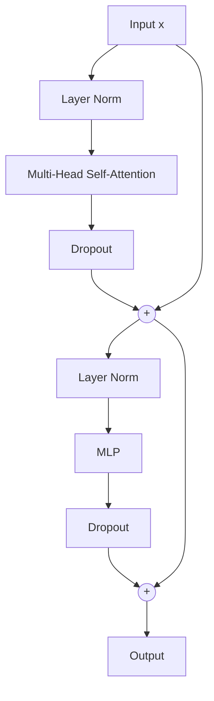

# Vision Transformer Architecture Guide

> [!info] Reference
> **Paper**: Dosovitskiy et al., "An Image is Worth 16x16 Words: Transformers for Image Recognition at Scale", ICLR 2021

## Overview

The Vision Transformer (ViT) adapts the [[Transformer]] architecture—originally designed for NLP tasks—to process images. Instead of using convolutions like traditional CNNs, ViT treats image patches as "tokens" and processes them through self-attention mechanisms.

> [!important] Key Insight
> Images can be split into fixed-size patches, linearly embedded, and processed as sequences—just like words in a sentence.

---

## How ViT Processes Images

### Step 1: Patch Embedding

The first step converts an image into a sequence of patches.

```
Input Image: (B, 3, 32, 32)
     ↓
Split into 4×4 patches → 64 patches total
     ↓
Linear projection → (B, 64, 256)
```

> [!example] Code Implementation
> ```python
> class PatchEmbedding(nn.Module):
>     def __init__(self, img_size: int, patch_size: int, embed_dim: int):
>         super().__init__()
>         self.n_patches = (img_size // patch_size) ** 2
>         # Conv2d with stride=patch_size extracts and projects patches
>         self.proj = nn.Conv2d(3, embed_dim, kernel_size=patch_size, stride=patch_size)
>
>     def forward(self, x):
>         # (B, C, H, W) → (B, D, H/P, W/P) → (B, D, N) → (B, N, D)
>         x = self.proj(x)
>         x = x.flatten(2).transpose(1, 2)
>         return x
> ```

For a 32×32 CIFAR-10 image with patch size 4:
- **Patches per dimension**: $32 \div 4 = 8$
- **Total patches**: $8 \times 8 = 64$
- **Each patch**: 4×4×3 = 48 pixels → embedded to 256 dimensions

### Step 2: Position Embedding + CLS Token

> [!note] Why Position Embeddings?
> Unlike CNNs, transformers have no inherent notion of spatial relationships. Position embeddings provide this information.

```python
# Class token - learnable token for classification
self.cls_token = nn.Parameter(torch.zeros(1, 1, embed_dim))

# Position embeddings - one for CLS token + N patches
self.pos_embed = nn.Parameter(torch.zeros(1, n_patches + 1, embed_dim))
```

The sequence becomes:
$$\mathbf{Z}_0 = [\mathbf{x}_{\text{cls}}; \mathbf{x}_p^1 \mathbf{E}; \ldots; \mathbf{x}_p^N \mathbf{E}] + \mathbf{E}_{pos}$$

---

## Transformer Block Structure

Each transformer block consists of two main sub-layers with residual connections:



### Multi-Head Self-Attention

> [!tip] Core Mechanism
> Self-attention allows each patch to "look at" all other patches and aggregate relevant information.

#### Mathematical Formulation

For input $\mathbf{X} \in \mathbb{R}^{N \times D}$:

1. **Linear Projections**:
   $$\mathbf{Q} = \mathbf{X}\mathbf{W}_Q, \quad \mathbf{K} = \mathbf{X}\mathbf{W}_K, \quad \mathbf{V} = \mathbf{X}\mathbf{W}_V$$

2. **Scaled Dot-Product Attention**:
   $$\text{Attention}(\mathbf{Q}, \mathbf{K}, \mathbf{V}) = \text{softmax}\left(\frac{\mathbf{Q}\mathbf{K}^T}{\sqrt{d_k}}\right)\mathbf{V}$$

3. **Multi-Head Attention**:
   $$\text{MultiHead}(\mathbf{X}) = \text{Concat}(\text{head}_1, \ldots, \text{head}_h)\mathbf{W}^O$$

#### Implementation

```python
class MultiHeadAttention(nn.Module):
    def __init__(self, embed_dim: int, num_heads: int, dropout: float = 0.0):
        super().__init__()
        self.num_heads = num_heads
        self.head_dim = embed_dim // num_heads
        self.scale = self.head_dim ** -0.5  # Scaling factor

        # Combined Q, K, V projection
        self.qkv = nn.Linear(embed_dim, embed_dim * 3)
        self.proj = nn.Linear(embed_dim, embed_dim)

    def forward(self, x):
        B, N, D = x.shape
        # Compute Q, K, V in one projection
        qkv = self.qkv(x).reshape(B, N, 3, self.num_heads, self.head_dim)
        qkv = qkv.permute(2, 0, 3, 1, 4)  # (3, B, H, N, D/H)
        q, k, v = qkv[0], qkv[1], qkv[2]

        # Attention scores
        attn = (q @ k.transpose(-2, -1)) * self.scale
        attn = F.softmax(attn, dim=-1)

        # Apply attention to values
        x = (attn @ v).transpose(1, 2).reshape(B, N, D)
        return self.proj(x)
```

> [!attention] Attention Interpretation
> - The attention matrix has shape $(N+1) \times (N+1)$ (including CLS token)
> - Each row shows how much a patch "attends" to all other patches
> - The CLS token's attention to patches indicates feature importance

### MLP (Feed-Forward Network)

```python
class MLP(nn.Module):
    def __init__(self, in_features: int, hidden_features: int, dropout: float = 0.0):
        super().__init__()
        self.fc1 = nn.Linear(in_features, hidden_features)  # Expand
        self.act = nn.GELU()
        self.fc2 = nn.Linear(hidden_features, in_features)  # Contract
        self.dropout = nn.Dropout(dropout)
```

> [!note] MLP Ratio
> The hidden dimension is typically 4× the embedding dimension. This expands, then contracts the representation.

---

## Complete Transformer Block

```python
class TransformerBlock(nn.Module):
    def forward(self, x):
        # Pre-norm architecture (LayerNorm before attention/MLP)
        x = x + self.attn(self.norm1(x))  # Residual connection
        x = x + self.mlp(self.norm2(x))   # Residual connection
        return x
```

> [!success] Key Design Choices
> 1. **Pre-LayerNorm**: Normalization is applied *before* attention and MLP (more stable training)
> 2. **Residual Connections**: Enable gradient flow through deep networks
> 3. **Dropout**: Regularization to prevent overfitting

---

## Full Vision Transformer Architecture

```
┌─────────────────────────────────────────────────────────────┐
│                    INPUT IMAGE (32×32×3)                     │
└─────────────────────────────────────────────────────────────┘
                              ↓
┌─────────────────────────────────────────────────────────────┐
│              PATCH EMBEDDING (4×4 patches)                   │
│         Output: (Batch, 64 patches, 256 embed_dim)          │
└─────────────────────────────────────────────────────────────┘
                              ↓
┌─────────────────────────────────────────────────────────────┐
│          PREPEND CLS TOKEN + ADD POSITION EMBEDDING         │
│         Output: (Batch, 65 tokens, 256 embed_dim)           │
└─────────────────────────────────────────────────────────────┘
                              ↓
┌─────────────────────────────────────────────────────────────┐
│                  TRANSFORMER ENCODER (×6 layers)            │
│  ┌─────────────────────────────────────────────────────┐   │
│  │ LayerNorm → Multi-Head Attention → Residual (+)     │   │
│  │ LayerNorm → MLP → Residual (+)                      │   │
│  └─────────────────────────────────────────────────────┘   │
└─────────────────────────────────────────────────────────────┘
                              ↓
┌─────────────────────────────────────────────────────────────┐
│                  LAYER NORMALIZATION                         │
└─────────────────────────────────────────────────────────────┘
                              ↓
┌─────────────────────────────────────────────────────────────┐
│              EXTRACT CLS TOKEN (index 0)                     │
│         Output: (Batch, 256)                                │
└─────────────────────────────────────────────────────────────┘
                              ↓
┌─────────────────────────────────────────────────────────────┐
│              CLASSIFICATION HEAD (Linear)                    │
│         Output: (Batch, 10 classes)                         │
└─────────────────────────────────────────────────────────────┘
```

---

## Key Differences from CNNs

| Aspect | CNN | Vision Transformer |
|--------|-----|-------------------|
| Inductive Bias | Translation equivariance, locality | Minimal (learns from data) |
| Receptive Field | Grows with depth | Global from layer 1 |
| Spatial Relationships | Preserved through feature maps | Via position embeddings |
| Data Efficiency | Works well with small datasets | Requires more data |

> [!warning] Data Requirements
> ViTs typically require large datasets or pretraining. For small datasets like CIFAR-10, heavy augmentation is essential.

---

## Training Configuration

```python
@dataclass
class ViTConfig:
    # Model
    patch_size: int = 4
    embed_dim: int = 256
    num_heads: int = 8
    num_layers: int = 6
    mlp_ratio: int = 4
    dropout: float = 0.1

    # Training
    batch_size: int = 128
    epochs: int = 10
    learning_rate: float = 3e-4
    weight_decay: float = 0.05
```

> [!tip] Optimization Tips
> - Use **AdamW** optimizer with weight decay
> - **CosineAnnealingLR** scheduler works well
> - **GELU** activation (smoother than ReLU)
> - **LayerNorm** instead of BatchNorm

---

## Related Concepts

- [[Transformer]] - Original attention mechanism
- [[Self-Attention]] - Core attention computation
- [[Positional Encoding]] - Adding position information
- [[Layer Normalization]] - Normalization technique
- [[Residual Connections]] - Skip connections

---

## See Also

- [[ViT_Architecture.canvas|Interactive Architecture Diagram]]
- Original Paper: [An Image is Worth 16x16 Words](https://arxiv.org/abs/2010.11929)